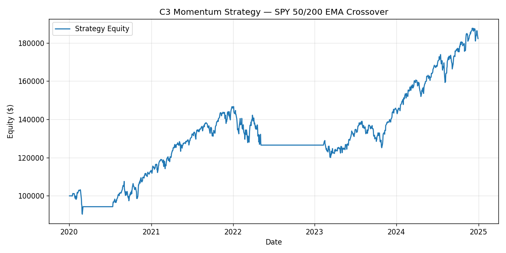

# C3 — Multi-Agent Trading Research System

> Three local LLM agents (Quant, Risk, Compliance) debate a trading-strategy
> proposal, vote, and log dissent + reasoning chain. Backtest is a 50/200 EMA
> momentum strategy on real SPY data, 2020-2024.
>
> Asset Management / IB resume signal.

## Demo



```text
$ python scripts/run_demo.py --offline
Backtest: SPY 50/200 EMA crossover, 2020-2024, 10bps fills, $100k
  Total return     +82.23%   (buy & hold +95.30%)
  Sharpe            0.862
  Max drawdown    -18.17%
  Trades              3

ROUND 2 final votes:
  Quant      APPROVE  (0.62)
  Risk       MODIFY   (0.78)   <- formal dissent: vol-target + -10% stop
  Compliance APPROVE  (0.90)
VERDICT: APPROVED  (2 approve / 0 reject / 1 modify)
```

Full output: [`docs/cli-demo.txt`](docs/cli-demo.txt) | Full debate: [`docs/sample-debate.md`](docs/sample-debate.md)

---

## Why this project

Real trading committees never approve a strategy on a single voice. A quant
sees Sharpe; a risk officer sees the tail; compliance sees the rulebook.
C3 reproduces that committee structure with three LLM agents that disagree,
respond to each other, and produce an auditable verdict with dissent tracked.

## Architecture

```
yfinance (SPY 2020-2024)
        |
        v
backtesting.py  ---> 50/200 EMA crossover  ---> metrics
        |
        v
build_proposal()  ---> proposal payload
        |
        v
+----------------+----------------+----------------+
|  Quant Agent   |  Risk Agent    | Compliance Agt |
|  (Sharpe,      |  (drawdown,    | (CFTC/SEC,     |
|   alpha)       |   VaR, tail)   |  manipulation) |
+----------------+----------------+----------------+
        |                |                |
        +-------- Round 1 (parallel) -----+
        |                |                |
        +--- peers' concerns shared ------+
        |                |                |
        +-------- Round 2 (final vote) ---+
                         |
                         v
              majority verdict + dissent
                         |
                         v
              docs/debate-transcript.jsonl
```

All three agents share **the same Ollama model (qwen2.5:7b)** but carry
**three distinct system prompts**. This is deliberate: it isolates the
behavioral split to the role mandate, not the model. No API keys.

## Stack (100% local)

| Concern   | Tool                                  |
| --------- | ------------------------------------- |
| LLM       | Ollama @ `localhost:11434`, qwen2.5:7b |
| Backtest  | `backtesting.py`                      |
| Data      | `yfinance` (SPY OHLCV)                |
| Frontend  | `streamlit`                           |
| CLI       | `click`                               |
| Tests     | `pytest` + mock Ollama fixtures       |

## Setup

```bash
# 1. Install Ollama and pull the model
brew install ollama
ollama pull qwen2.5:7b
ollama serve   # leave running

# 2. Install Python deps
python -m venv .venv
source .venv/bin/activate
pip install -e ".[dev]"
```

## Run the demo

```bash
# Live (calls Ollama for real)
python scripts/run_demo.py

# Offline (deterministic mock LLM, no Ollama needed)
python scripts/run_demo.py --offline
```

Outputs:

- `docs/debate-transcript.jsonl` — full debate, one JSON event per line
- `docs/equity-curve.png` — backtest equity curve
- console summary of backtest metrics + verdict

## Streamlit dashboard

```bash
streamlit run app.py
```

Sidebar lets you set start/end dates, fast/slow EMAs, and pick **Live Ollama**
vs **Replay last transcript**.

## Tests

```bash
pytest -q
```

The Ollama client is mocked end-to-end via fixtures in `tests/conftest.py`,
so the suite runs offline.

## Layout

```
src/c3_multi_agent_trading/
  agents.py     # 3 system prompts + Agent class around Ollama
  debate.py     # 2-round orchestrator, vote tally, JSONL transcript
  strategy.py   # 50/200 EMA strategy + yfinance loader
  runner.py     # backtest -> proposal -> debate -> CommitteeVerdict
scripts/run_demo.py   # CLI entry point
app.py                # Streamlit dashboard
docs/
  debate-transcript.jsonl
  equity-curve.png
  sample-debate.md    # narrated transcript of one offline run
tests/                # pytest with mocked Ollama
STATE.md              # current state
```

Files capped at 300 lines.

## Author

Yash Patel | Tempe, AZ | yashpatel06050@gmail.com  
LinkedIn: linkedin.com/in/yash-patel-67449029b  
GitHub: github.com/ypatel39-commits
